# Concept Proposal: Complyance Oracle Fusion Cloud ERP Marketplace Extension

---

# Brief: The Idea in Two Pages

> **Purpose:** A fast read for the founder and technical leadership. The sections after this brief contain the deeper API research, architectural rationale, and implementation detail.

## Page 1: The product opportunity

### The idea in one sentence

Build **Complyance for Oracle Fusion Cloud ERP** as an Oracle Cloud Marketplace application that turns Complyance’s existing e-invoicing APIs into a **prebuilt, Oracle-native compliance workflow**.

### What I would build

The product sits between **Oracle Fusion Cloud ERP** and the existing **Complyance platform**. It does not replace Complyance’s compliance engine. Instead, it removes the integration work that each Oracle customer would otherwise have to repeat.

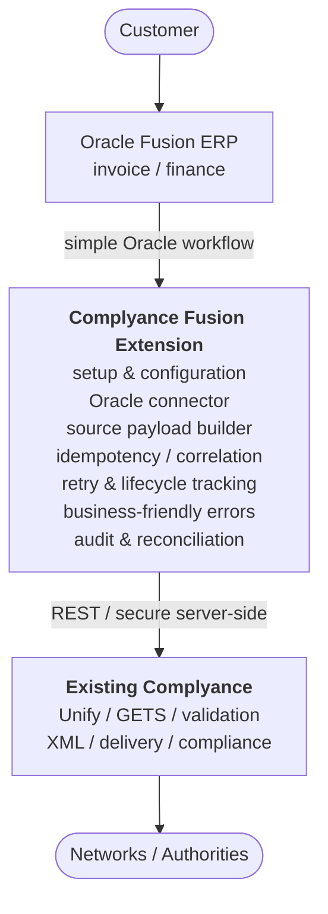

### Why this is the right product boundary

My research of the current Complyance developer documentation shows that **Complyance already owns the hard compliance problems**:

- Unify V2 is the recommended contract for new integrations.
- Source mapping converts a customer/source payload into the canonical GETS model.
- Complyance performs mapping, validation, XML generation/validation, and downstream processing.
- The API supports single-document and bulk submission patterns.
- Submission is asynchronous: the caller receives a `documentId` and follows the document lifecycle until a terminal result.
- Validation failures return structured findings that include paths, rule information, and human-readable messages.

That changes the product strategy: **do not build a second tax/compliance engine. Build the Oracle product around the existing engine.**

### Customer value

The customer buys a **faster path to go-live**, not an API integration project.

The extension should remove or productize the repetitive work around:

**connect → configure → map → submit → track → resolve → retry → audit**

The desired user experience is that a finance user stays in Oracle Fusion and sees something like:

> **E-Invoicing: Processing**
>
> Complyance reference: `6a7e...`
>
> Last updated: 13:42

Or, for a validation issue:

> **Submission blocked**: Customer tax registration number is missing.
>
> Fix the Oracle customer record and resubmit.

The raw Complyance API remains underneath, but the customer does not have to become an API integrator to operate e-invoicing.

# Brief: Page 2

## What makes this more than a connector

A thin connector only moves JSON between systems. This proposal is a **productized compliance workflow**.

### Core MVP

**1. Marketplace onboarding**

Install → connect Fusion → connect Complyance → select sandbox/production → choose legal entities/countries → run readiness check → send a test invoice.

**2. Invoice submission**

Support a manual **Submit for E-Invoicing** action first, with controlled automatic submission designed into the architecture.

**3. Lifecycle tracking**

Persist Complyance `documentId`; track `submitted → processing → terminal result`; reflect the business state back into Oracle.

**4. Actionable errors**

Translate Complyance’s structured 422 findings into business-facing exceptions instead of exposing technical JSON.

**5. Safe retries**

Separate business validation failures from transient technical failures. Retry only when appropriate and never blindly resubmit an invoice after an uncertain timeout.

**6. Auditability**

Keep the Oracle invoice, Complyance `documentId`, state history, request IDs, validation findings, and retry history correlated.

### Why a hybrid architecture is my recommendation

I would **not** put the whole integration inside Oracle Fusion.

Complyance's own published Oracle Fusion integration guide backs this up in an unintentional way: it lists four ways a customer could connect Oracle Fusion to Complyance today: Oracle Integration Cloud, Oracle SOA Suite, an API Gateway proxy, or custom-written code, and leaves the choice, and the build, entirely to the customer. That's a decision tree, not a product. It's exactly the gap a packaged Complyance-owned orchestration layer would close, and it's why I'm recommending Complyance own that layer rather than leaving it to whichever of the four options a given customer happens to pick. (Full detail in Section 7.)

I recommend:

**Oracle Fusion = customer-facing business workflow**

**Complyance integration service = orchestration and reliability boundary**

**Complyance APIs = compliance engine**

That gives us a reusable service for credentials, idempotency, asynchronous status tracking, retries, audit, and monitoring, while keeping the user experience close to the ERP.

### The deeper technical reason

Complyance’s current Unify V2 model makes **source mapping** a first-class concept. That means the Oracle extension can publish a stable Oracle source contract and let Complyance perform the source→GETS transformation and country-specific validation.

Conceptually:

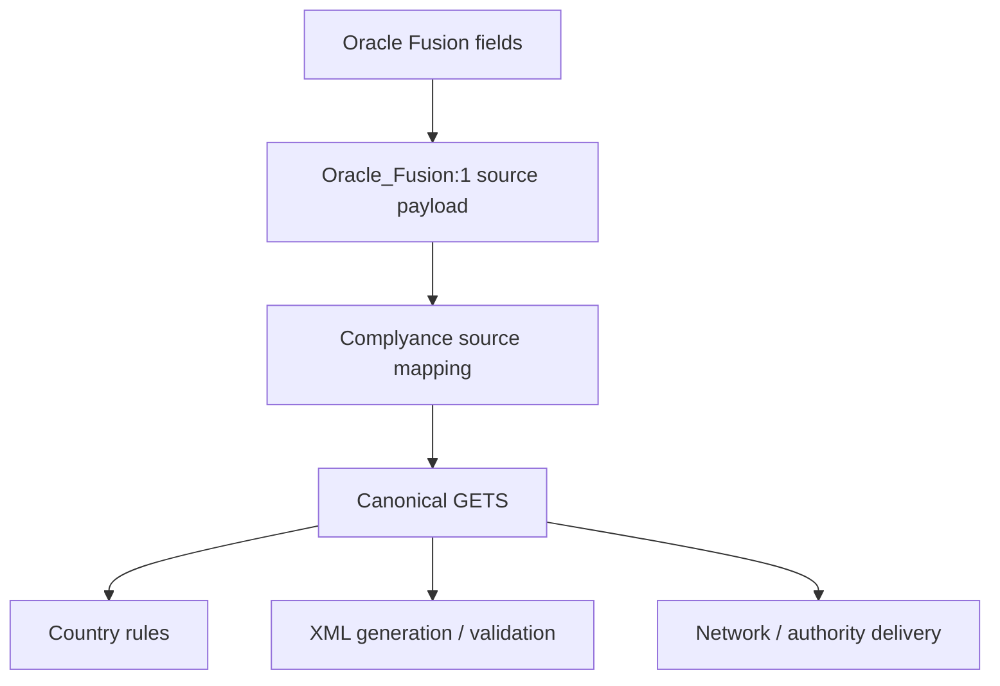

This should make country expansion much more scalable than maintaining a separate Oracle transformation implementation for every jurisdiction.

### What I would prove first

The first proof should be intentionally narrow:

> **One Oracle Fusion invoice type + one country + one end-to-end sandbox flow.**

Success means we can create an invoice in Fusion, submit it through the extension, receive a Complyance `documentId`, follow the asynchronous lifecycle, show an understandable result in Oracle, and recover correctly from a validation or transient technical failure.

### Key technical questions for Complyance

Before committing to the final architecture, I would validate:

- The exact current Unify V2 request/response contract and supported document types.
- The preferred Oracle Fusion integration pattern. Complyance's public integration guide names four candidate patterns (OIC, SOA Suite, API Gateway, custom REST) without recommending one, so I'd want to know which of these, if any, Complyance already sees working best in the field before locking in the hybrid architecture below.
- How Complyance wants Oracle customer/company/source provisioning handled.
- Whether status webhooks are available for the required lifecycle or polling is the intended model.
- How the target country/document mapping should be represented and versioned.
- Which generated artifacts, authority references, and delivery responses should be surfaced in Fusion.
- Oracle Marketplace packaging, hosting, tenant isolation, and certification requirements.

### The strategic proposition

**Complyance already has the compliance infrastructure.**

The proposed product turns that infrastructure into a **repeatable Oracle Fusion offering** that can shorten implementation, reduce custom integration work, and give finance teams a much better operational experience.

That is the product I would build with the Complyance team: **not another e-invoicing engine, but the fastest Oracle Fusion path into the existing Complyance engine.**

## Contents

**Part I: Core Proposal**
- [Founder Brief: The Idea in Two Pages](#founder-brief-the-idea-in-two-pages)
  - [Page 1: The Product Opportunity](#page-1-the-product-opportunity)
- [Founder Brief: Page 2](#founder-brief-page-2)
  - [What Makes This More Than a Connector](#what-makes-this-more-than-a-connector)
- [Executive Summary](#executive-summary)
- [1. Research Summary: What Complyance Already Provides](#1-research-summary-what-complyance-already-provides)
- [2. The Market Gap I Would Target](#2-the-market-gap-i-would-target)
- [3. Product Concept](#3-product-concept)
- [4. Product Principles](#4-product-principles)
- [5. What the Extension Should Offer](#5-what-the-extension-should-offer)
- [6. Proposed Architecture](#6-proposed-architecture)
- [7. Oracle Fusion Integration Options](#7-oracle-fusion-integration-options)
- [8. Oracle-to-Complyance Data Flow](#8-oracle-to-complyance-data-flow)
- [9. The Most Important Product Design Decision: Where Mapping Lives](#9-the-most-important-product-design-decision-where-mapping-lives)
- [10. Country Expansion Strategy](#10-country-expansion-strategy)
- [11. A Potentially Stronger Product: Compliance Center for Fusion](#11-a-potentially-stronger-product-compliance-center-for-fusion)
- [12. Marketplace Product Boundary](#12-marketplace-product-boundary)
- [13. MVP Definition](#13-mvp-definition)

**Part II: Technical Appendix**
- [14. Phase 2](#14-phase-2)
- [15. Phase 3](#15-phase-3)
- [16. Recommended Development Approach](#16-recommended-development-approach)
- [17. Technical Data Model](#17-technical-data-model)
- [18. API Interaction Model](#18-api-interaction-model)
- [19. Error Classification Matrix](#19-error-classification-matrix)
- [20. Security Model](#20-security-model)
- [21. Why This Can Be Better Than a Generic Oracle Integration Project](#21-why-this-can-be-better-than-a-generic-oracle-integration-project)
- [22. Differentiation](#22-differentiation)
- [23. What I Would Explicitly NOT Build in the First Version](#23-what-i-would-explicitly-not-build-in-the-first-version)
- [24. Key Technical Questions for Complyance Engineering](#24-key-technical-questions-for-complyance-engineering)
- [25. Risks I See](#25-risks-i-see)
- [26. Recommended Product Roadmap](#26-recommended-product-roadmap)
- [27. Success Metrics](#27-success-metrics)
- [28. My Recommendation](#28-my-recommendation)
- [29. The Product I Would Build](#29-the-product-i-would-build)

---

## Executive Summary

Complyance already has the most important part of the solution: a global e-invoicing platform with a unified developer experience, GETS as its canonical framework, country-specific mappings, validation, sandbox capabilities, and APIs for document submission and status retrieval. The current documentation explicitly recommends Unify V2 for new integrations and documents source mapping, validation, single/bulk requests, and asynchronous document status flows.

The opportunity I see is **not to build another e-invoicing engine**. It is to package Complyance's existing capabilities into a **productized Oracle Fusion Cloud ERP experience** that customers can discover through Oracle Cloud Marketplace, configure, and use without having to build a custom integration around Complyance's API.

The product would sit between Oracle Fusion and Complyance, owning the Oracle-specific experience and cross-cutting integration responsibilities while keeping compliance processing inside Complyance.

> **Turn Complyance's powerful developer-first API into a faster-to-implement, easier-to-operate Oracle Fusion product.**

This directly supports the customer goal I would optimize for: **faster implementation and faster go-live**.

---

## 1. Research Summary: What Complyance Already Provides

The public documentation shows that Complyance is already designed to remove a large amount of the complexity that normally exists in global e-invoicing integrations.

### 1.1 Unified API and GETS

Complyance describes GETS as its proprietary standard e-invoicing framework for unifying global and local compliance requirements. Its developer materials position the platform around a single standardized payload, source mappings, automated country handling, validation, sandbox testing, and reusable integration tooling.

The current Unify V2 API is explicitly described as the **recommended contract for new integrations**. For each document, Complyance resolves the workspace source mapping, converts the source payload into a canonical GETS document, validates it, generates and validates invoice XML, and returns a document result or structured validation findings.

**Implication for the proposed extension:** Oracle Fusion should not have to understand each country's native e-invoice schema. The extension should produce a stable source payload and let Complyance perform the compliance transformation.

Sources:
- [Complyance Developers](https://complyance.io/developers)

### 1.2 Source Mapping Is a Core Product Capability

The current documentation describes a source mapping model: the caller identifies its `source` (for example, `name:version`) and sends its original source-system JSON. Complyance maps that payload to the canonical GETS model. The caller does **not** need to rename its source fields or manually construct GETS.

This is strategically important for Oracle Fusion. The extension can treat the Oracle Fusion invoice representation as a source system and make that mapping a first-class product asset rather than embedding country-specific mappings into the Oracle layer.

### 1.3 Current Country Mapping Documentation

The current field-mapping reference publicly documents Saudi Arabia, Malaysia, Belgium, Germany, and UAE mappings, with country extensions where applicable. The country pages show that requirements are not limited to a basic invoice header: depending on the jurisdiction, fields can include document IDs, issue dates/times, document types, tax currency, exchange rate, due dates, reference invoices, process identifiers, and country-specific extensions.

Examples:

- Saudi Arabia includes ZATCA-specific rules such as mandatory document identity, issue time, tax currency, and conditional exchange-rate / credit-note information.
- UAE uses PINT AE and includes UAE-specific fields such as tax currency, exchange rate, due date, and credit-note reason.
- Belgium uses Peppol BIS Billing 3.0 and requires process/specification identifiers in the documented mapping.
- Germany includes XRechnung-related extension behavior.

**Implication:** the Oracle extension should not hard-code a global list of fields. It needs a configurable capability model that can surface the relevant requirements for the selected country/document type.

### 1.4 Validation Is Detailed Enough to Power a Good Oracle UX

One of the strongest findings in the API documentation is the structure of validation failures.

For HTTP `422`, Complyance can return:

- a rule code,
- the canonical GETS path,
- the original source payload path,
- a human-readable message,
- severity,
- and the applicable rule set.

The documentation specifically recommends starting with `payloadPath` when correcting source data and using `getsPath` to understand the mapped canonical field.

This is ideal for a productized Oracle experience. The extension can translate an API validation response into a business-friendly Fusion exception such as:

> **Invoice cannot be submitted:** Amount due is missing.  
> Oracle field: Amount Due  
> Compliance field: `totals.amountDue`  
> Rule: AE tax invoice

That is materially different from exposing a raw JSON response to a finance user.

### 1.5 The API Already Supports Both Single and Bulk Documents

Unify V2 supports a direct single-document request as well as a bulk `invoices` array where each item is self-contained. This opens the door to multiple Oracle operating modes without changing the underlying compliance engine:

- invoice-level manual submission,
- scheduled batches,
- high-volume automated submission,
- controlled reprocessing.

### 1.6 Asynchronous Document Lifecycle Is Explicit

Current documentation shows a two-step model for submission and final outcome retrieval:

1. Submit the invoice and save `documentId`.
2. Retrieve status using `GET /api/v3/documents/{documentId}/status`.
3. Continue until `isTerminal` is true.

The documented lifecycle includes:

`submitted -> processing -> delivery_success / delivery_failed -> final_valid / final_invalid`

with `rejected` as a terminal state for validation failure at submission.

**Implication:** the Oracle extension needs a proper state machine and should never treat a successful API request as equivalent to final government acceptance.

### 1.7 Authentication and Environment Separation Are Explicit

The current documentation states that API keys are environment-specific. Connect API v3 uses `X-API-Key`; Unify V2 examples use the API key as a Bearer token. The documentation instructs implementers to store keys server-side and explicitly warns against putting them into browser or client applications, source control, or logs.

**Implication:** customer credentials should never be exposed in the Oracle UI or embedded in client-side code. The extension needs a server-side trust boundary.

---

## 2. The Market Gap I Would Target

Complyance already solves the difficult **e-invoicing compliance layer**.

What remains for an Oracle Fusion customer is the **ERP integration product problem**, and Complyance's own published guidance shows this gap is still open today. Complyance's Oracle Fusion integration guide (see Section 7) describes four ways a customer could build the connection (OIC, SOA Suite, an API Gateway proxy, or custom code) but stops at "here are your options," not "here is the product." That's the market gap in this customer's own words, published by the company that would build the fix:

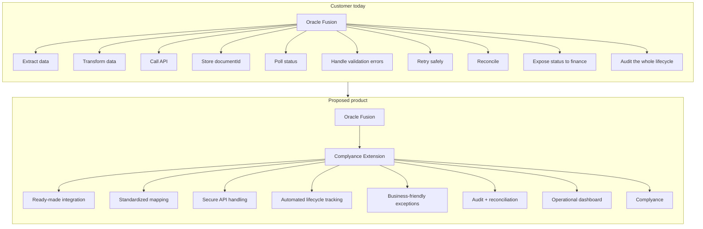

The product opportunity is therefore not simply **"Oracle + API"**.

It is:

> **"Oracle Fusion + a packaged compliance workflow."**

---

## 3. Product Concept

### Working name

**Complyance for Oracle Fusion Cloud ERP**

The product would be positioned as an Oracle Cloud Marketplace application that connects Oracle Fusion invoice workflows to Complyance's global e-invoicing platform.

### Core value proposition

For customers:

> **Go from Oracle Fusion invoice to compliant e-invoice with a prebuilt integration, without designing and maintaining a custom Complyance integration.**

For Complyance:

> **Turn the existing API into a repeatable Oracle product that can be deployed across multiple customers and countries.**

---

## 4. Product Principles

### Principle 1: Do not duplicate Complyance

The extension should **use** Complyance's API and compliance engine rather than recreate:

- country tax logic,
- GETS transformation logic,
- XML generation,
- country-specific adapters,
- authority connectors.

The differentiator should be the **Oracle Fusion product experience**.

### Principle 2: Oracle should remain the system of business record

Oracle Fusion should remain the source of the invoice and the main business-user environment. Complyance should remain the compliance processing layer.

### Principle 3: Productize the difficult integration steps

The extension should absorb as much reusable implementation effort as possible:

- connectivity,
- source mapping,
- environment management,
- status synchronization,
- exception handling,
- retry logic,
- correlation,
- audit,
- reconciliation.

### Principle 4: Country expansion should be configuration-led

The architecture should make adding a new country mostly a matter of supporting the appropriate Complyance mapping/configuration rather than rewriting the Oracle integration.

### Principle 5: Design for asynchronous reality

A submission is not the same thing as final acceptance. The product must model the full lifecycle.

---

## 5. What the Extension Should Offer

## 5.1 Installation and Tenant Setup

The Marketplace product should provide a repeatable onboarding path:

1. Install / subscribe.
2. Connect the customer's Oracle Fusion environment.
3. Connect the customer's Complyance tenant/workspace or provision the appropriate relationship.
4. Select environment: sandbox or production.
5. Select legal entities / business units.
6. Select supported countries.
7. Configure invoice/document types.
8. Run connectivity and readiness checks.
9. Submit a test invoice.
10. Enable production processing.

The setup wizard should hide infrastructure complexity wherever possible.

---

## 5.2 Oracle Invoice Extraction

The extension should obtain the invoice information required to build the Complyance source payload.

A normalized Oracle-side payload should be produced rather than immediately coupling every downstream component to raw Fusion structures.

Example logical payload:

```json
{
  "source": {
    "system": "oracle-fusion",
    "version": "1.0"
  },
  "invoice": {
    "externalId": "FUSION-INVOICE-ID",
    "documentNumber": "INV-1001",
    "issueDate": "2026-09-14",
    "currency": "AED"
  },
  "seller": {},
  "buyer": {},
  "lines": [],
  "tax": {},
  "payment": {},
  "references": {}
}
```

The exact payload should be aligned with the Complyance source mapping strategy rather than inventing an unrelated internal canonical model.

---

## 5.3 Source Mapping Strategy

This is one of the areas where the current Complyance platform makes the product easier to design.

The extension should establish a stable **Oracle Fusion source mapping** such as:

`ORACLE_FUSION:1`

Complyance's current Unify model can then use the source alias/version to apply the configured mapping for the requested country and document type.

This allows the architecture to separate:

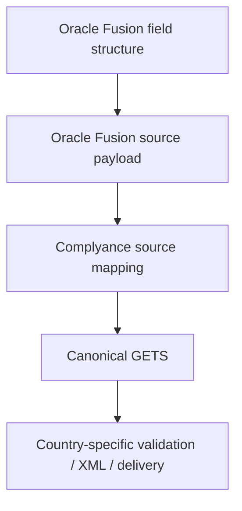

That is preferable to creating separate Oracle mappings for every country.

---

## 5.4 Submission Modes

The product should support multiple modes, but not all need to be in the first release.

### Mode A: Manual

Finance user selects:

**Submit for E-Invoicing**

### Mode B: Automatic

Invoice enters an eligible status and the extension submits it automatically.

### Mode C: Scheduled batch

A background process collects eligible invoices and sends them in controlled batches using the Complyance bulk contract.

### Mode D: Retry / resubmit

An invoice with a transient technical failure can be retried without creating a new business invoice.

**MVP recommendation:** manual + controlled automatic submission. Bulk should be designed from the beginning even if exposed later.

---

## 5.5 Compliance Status in Oracle Fusion

The extension should maintain a clear compliance status associated with the Oracle invoice.

Suggested states:

| Extension State | Meaning |
|---|---|
| `NOT_READY` | Required business data is incomplete |
| `READY` | Eligible for compliance submission |
| `SUBMITTING` | Request is being sent |
| `SUBMITTED` | Complyance accepted the document into processing |
| `PROCESSING` | Compliance / delivery processing is ongoing |
| `DELIVERY_FAILED` | Handoff to the target network/authority failed |
| `ACCEPTED` | Final compliant result available |
| `REJECTED` | Final rejection / validation result |
| `RETRY_REQUIRED` | Technical failure requires retry |

The implementation should preserve the underlying Complyance state so that an Oracle-friendly label does not destroy diagnostic fidelity.

---

## 5.6 Business-Friendly Validation Errors

The API gives enough structured data to build a strong exception UI.

A useful Fusion exception record could contain:

| Field | Example |
|---|---|
| Oracle Invoice | INV-1001 |
| Complyance Document ID | 6a7eab... |
| Severity | Error |
| Business Message | Amount due is missing |
| Oracle Payload Path | `invoice_data.amount_due` |
| GETS Path | `totals.amountDue` |
| Rule Code | IBR-015 |
| Rule Set | `ae:tax_invoice` |
| Resolution | Add the amount due and resubmit |

This is directly supported by the structure documented by Complyance for 422 validation responses.

The extension should also group errors by business domain:

- Header
- Seller
- Buyer
- Tax
- Lines
- Totals
- Payment
- Country-specific requirements

That would make large validation responses operationally manageable for finance users.

---

## 5.7 Safe Retry and Idempotency

A major integration responsibility belongs in the extension layer.

The product must distinguish:

- **business validation errors**: do not blindly retry; fix data first,
- **configuration errors**: do not retry unchanged,
- **authentication failures**: fix credentials/configuration,
- **rate limits**: retry with backoff and respect `Retry-After`,
- **temporary service failures**: controlled retry,
- **unknown timeouts**: use correlation and duplicate protection before resubmitting.

The current documentation explicitly distinguishes HTTP `422` validation failures from transport/request failures and recommends treating rate limits through `Retry-After` handling.

### Proposed extension rule

Never create a second submission simply because the first network attempt timed out.

Maintain a durable record such as:

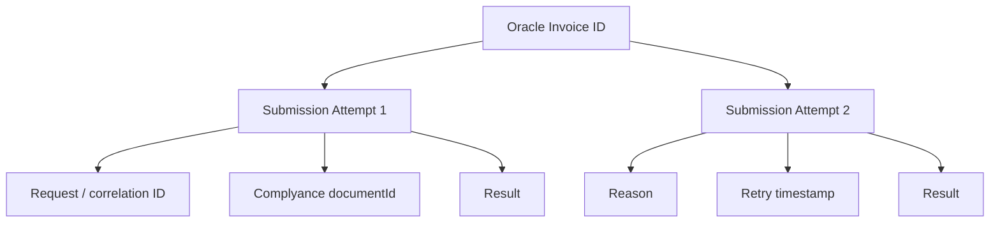

The system should make duplicate submission prevention a first-class invariant.

---

## 5.8 Audit Trail

For every submitted invoice, maintain:

- Oracle invoice reference.
- Complyance document ID.
- Country.
- Environment.
- Source version.
- Document type.
- Submission timestamp.
- Current state.
- State history.
- Validation results.
- Retry attempts.
- API request IDs.
- Final authority/compliance response references.
- User or process that initiated the action.

This turns the extension into an operational compliance record rather than a thin API proxy.

---

## 5.9 Reconciliation

A valuable phase-two capability is a reconciliation process that answers:

- Which Oracle invoices should have been submitted but were not?
- Which invoices are still processing?
- Which invoices failed?
- Which invoices have a final accepted status?
- Which Oracle records have no matching Complyance document ID?
- Which Complyance records cannot be reconciled to an Oracle invoice?

Complyance's current Connect API documentation also exposes document counts by country/company/date, which may be useful as an operational cross-check for certain deployments.

---

## 5.10 AI-Native Capabilities (Phase 2+)

Two capabilities where AI adds real value in the extension's own layer, without duplicating Complyance's compliance logic. Both are designed to live inside Oracle Fusion itself, where the finance and operations users already work, rather than as a separate tool they have to open.

### Pre-Submission Risk Scoring

This runs directly on the invoice screen inside Oracle Fusion. Before an invoice is submitted, the extension scores it against patterns in that customer's own prior validation failures, things like missing tax registration, wrong currency for the selected country, or incomplete buyer details, and flags a likely rejection right there, before the API call is made. The finance user sees the warning and fixes the data without leaving Oracle Fusion.

This is a different layer from Complyance's own field mapping confidence scoring, which evaluates a mapping definition at setup time and is aimed at the developer building the integration. Risk scoring here evaluates one specific invoice at submission time and is aimed at the finance user working inside their existing ERP. The two do not overlap.

The goal is to catch the errors most commonly seen for that customer's own countries and document types, cutting down the cycle of submit, fail, fix, and resubmit that a finance user otherwise goes through.

### Reconciliation Copilot

Also embedded in Oracle Fusion, as a query box inside the Compliance Center, this is a natural language layer over the audit and reconciliation data described in Section 5.9 and Section 17. Instead of a finance or operations user manually cross referencing Oracle invoice records against Complyance document status, they can type something like "why does invoice INV 1044 still show as processing" or "list every UAE invoice that failed for a tax reason last week" and get an answer traced through the actual submission, retry, and status history, without switching screens.

This turns the reconciliation dataset from something a report gets generated from into something a person can ask directly, from inside the ERP they already use every day.

Both capabilities are proposed additions to this document's own product layer, not claims about an existing Complyance feature. They fit best as a later phase once the core Phase 1 connector (Section 13, MVP Definition) is proven end to end.

---

## 6. Proposed Architecture

### 6.1 Architecture Recommendation

I recommend a **hybrid architecture** rather than putting all logic directly inside Oracle Fusion. The core product boundary is:

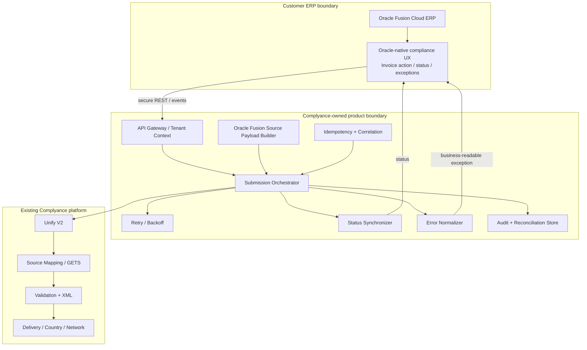

### Architectural boundary in one picture

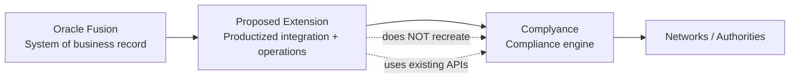

### Why this architecture?

Because Oracle Fusion should provide the customer-facing business experience, while the integration service should own cross-cutting integration concerns:

- API credentials,
- retries,
- persistence,
- asynchronous polling,
- webhook processing if available,
- idempotency,
- monitoring,
- mapping version management.

This makes the Marketplace product easier to evolve without embedding every API behavior into Oracle.

---

## 7. Oracle Fusion Integration Options

Complyance has already published an Oracle Fusion technical integration guide describing four integration approaches: Oracle Integration Cloud (OIC), Oracle SOA Suite, an Oracle API Gateway proxy pattern, and custom development directly against the API in a general-purpose language.

That confirms something useful in both directions.

First, the reassuring read: Oracle-to-Complyance connectivity is not a new concept. The building blocks (a pre-built OIC connector, service-bus routing via BPEL, gateway proxying, or direct REST calls) are already understood and documented, so this proposal is not asking anyone to invent unproven plumbing.

Second, and more useful for the founder pitch, is what the guide reveals about the current state of the market. It presents the four approaches as a **menu the customer has to choose from and build themselves**: pick OIC, or SOA Suite, or a gateway, or write custom code, then design your own connection, mapping, error handling, and monitoring around whichever one you picked. There is no single supported, packaged path; every customer connecting Oracle Fusion to Complyance today is effectively being pointed at a build-it-yourself decision tree.

That is the gap this proposal closes. **This document proposes turning that decision tree into one product**: a specific, opinionated, pre-built implementation (the hybrid architecture below) that removes the "which of four approaches, and who builds it" question entirely. The guide is, in effect, describing the DIY version of exactly what the Marketplace extension should productize.

Source:
- [Complyance: Oracle Fusion Technical Integration Guide](https://complyance.io/blog/zatca-e-invoicing-oracle-fusion-integration-guide)

### Recommendation

Evaluate four implementation patterns during architecture discovery, using Complyance's own documented approaches as the starting set:

| Pattern | Role | Recommendation |
|---|---|---|
| Oracle Integration Cloud | Customer/Oracle-side orchestration | Strong option where customers already use OIC |
| Oracle SOA Suite | Customer-side middleware via BPEL / Service Bus | Viable for customers already standardized on SOA Suite; heavier to stand up net-new |
| External integration service (this proposal) | Complyance-owned orchestration | Preferred for a reusable Marketplace product: the one option the current guide doesn't describe, because it doesn't exist yet |
| API Gateway pattern | Security / controlled proxy | Useful as a supporting component in front of any of the above, not the whole product |

Custom development (writing direct HTTP calls in Java, Python, or PL/SQL) is the guide's fourth option, and effectively the default for a customer with no existing OIC or SOA Suite investment. It's also the most expensive and least reusable path, which is the clearest evidence that a packaged Marketplace product has room to win: today, "custom development" is less a choice than what's left when there's no product.

The product should avoid forcing every customer to operate a unique middleware design, which is exactly the situation the current guide leaves them in.

---

## 8. Oracle-to-Complyance Data Flow

### Step 1: Invoice becomes eligible

Oracle Fusion determines that an invoice is ready for e-invoicing.

### Step 2: Extension creates source payload

The connector extracts the necessary business data and builds the configured Oracle Fusion source payload.

### Step 3: Pre-flight checks

The extension verifies:

- required connectivity,
- country configuration,
- environment,
- legal entity mapping,
- document type,
- presence of mandatory Oracle-side values,
- duplicate/submission state.

### Step 4: Complyance Unify V2 request

The extension submits a self-contained document using:

- country,
- environment,
- purpose=`invoicing`,
- source alias/version,
- document type,
- source payload.

### Step 5: Persist document ID

The extension stores the returned `documentId` with the Oracle invoice.

### Step 6: Track async lifecycle

The extension retrieves document status until the documented terminal state is reached.

### Step 7: Update Oracle

Oracle receives the customer-facing result:

- Accepted,
- Rejected,
- Processing,
- Delivery failed,
- Retry required.

### Step 8: Audit / reconciliation

The full transaction remains traceable across Oracle and Complyance.

---

## 9. The Most Important Product Design Decision: Where Mapping Lives

I would deliberately avoid a country-by-country Oracle mapping architecture.

Instead:

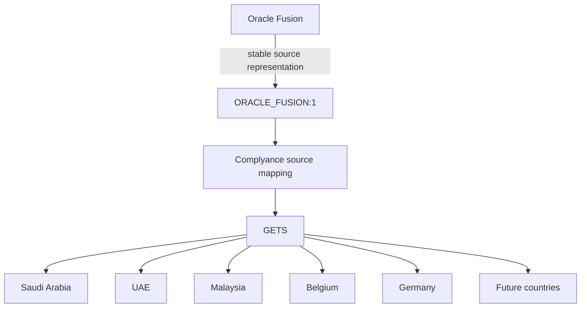

This aligns with the current Complyance design, where the source mapping is resolved by Complyance and the payload is then converted into canonical GETS.

That makes the Oracle product **country-extensible** instead of country-hardcoded.

---

## 10. Country Expansion Strategy

The extension should launch with one country, but the product should be architected for many.

### Why start with one?

A country-specific pilot gives the team a chance to prove:

- Oracle field availability,
- mapping correctness,
- validation UX,
- authority response handling,
- performance,
- support workflow.

### Which country should be first?

**Recommendation: choose the first country based on Complyance's strongest existing customer demand and most mature integration path, not purely on technical convenience.**

The current public documentation provides particularly detailed mapping material for UAE, Saudi Arabia, Malaysia, Belgium, and Germany. UAE also has a current Connect API v3 onboarding flow for UAE companies.

That makes UAE a strong **technical proof-of-concept candidate**, while Saudi Arabia may be attractive if the commercial priority is the ZATCA customer base. The final choice should be made jointly with Complyance.

---

## 11. A Potentially Stronger Product: Compliance Center for Fusion

The extension can evolve beyond "submit invoice".

I would design the product around a **Compliance Center** concept.

### Compliance Center

A finance/tax user could see:

**Today's E-Invoicing Status**

| Metric | Count |
|---|---|
| Invoices processed | 1,245 |
| Accepted | 1,201 |
| Processing | 23 |
| Rejected | 14 |
| Retry required | 7 |

And drill down:

| Invoice | Country | Status | Action |
|---|---|---|---|
| INV-1001 | AE | Accepted | View result |
| INV-1002 | AE | Rejected | Fix data |
| INV-1003 | SA | Processing | View status |
| INV-1004 | BE | Retry | Retry |

The dashboard would become particularly valuable in multi-country environments where finance teams otherwise have no single operational view of electronic-invoicing compliance.

This is a natural UX layer on top of Complyance's existing API and document lifecycle rather than a duplicate compliance engine.

---

## 12. Marketplace Product Boundary

The product should have a clear boundary.

### The extension owns

- Oracle Fusion connectivity.
- Oracle invoice eligibility rules.
- Oracle data extraction.
- Source payload creation.
- Customer configuration.
- Submission orchestration.
- Correlation.
- Retry policy.
- Oracle-facing error UX.
- Oracle-facing status.
- Audit / reconciliation.
- Marketplace packaging.

### Complyance owns

- Global compliance engine.
- GETS.
- Country mappings and regulatory logic.
- XML generation and validation.
- Country-specific adapters.
- Tax authority/network delivery.
- Compliance rule updates.

That boundary is essential. It keeps the Marketplace product valuable without turning it into a competing implementation of Complyance itself.

---

## 13. MVP Definition

### MVP Goal

Prove this statement:

> **A customer with Oracle Fusion can connect to Complyance, submit an invoice from Fusion, receive a final compliance outcome, and resolve failures without building a custom e-invoicing integration.**

### MVP capabilities

#### Integration

- Oracle Fusion Cloud ERP connector.
- Secure Complyance connection.
- Sandbox support.
- Production configuration.

#### Invoice processing

- One invoice type initially.
- One target country initially.
- Manual submission.
- Controlled automatic submission.
- Source payload mapping.

#### Compliance lifecycle

- Complyance `documentId` persistence.
- Status retrieval.
- Accepted/rejected/processing state handling.
- Validation error display.
- Retry for eligible technical failures.

#### Operations

- Audit history.
- Basic monitoring.
- Duplicate protection.
- Basic reconciliation report.

#### UX

- Configuration page.
- Submission action.
- Compliance status view.
- Error resolution view.

---

# Part II: Technical Appendix

> Sections 14 to 29 contain the supporting implementation detail: phased roadmap, development sequencing, data model, API contracts, error handling, security model, differentiation, risks, and success metrics. This material backs up the core proposal above, but isn't required reading to evaluate the concept; the core pitch (Founder Brief through Section 13) stands on its own.

---

## 14. Phase 2

After proving the MVP:

- Bulk submissions.
- Credit/debit notes.
- Advanced dashboard.
- Automatic webhook/event-driven updates where supported.
- Document artifact access.
- Advanced reconciliation.
- Multi-country configuration.
- Multi-legal-entity support.
- Role-specific access.
- Better reporting.
- Pre-submission risk scoring and a reconciliation copilot (Section 5.10).

---

## 15. Phase 3

- Additional countries.
- Additional Fusion invoice flows.
- Purchase-side capabilities where strategically relevant.
- More automation.
- Partner/implementation tooling.
- Enterprise analytics.
- Multi-ERP strategy using the same integration-service concepts.

---

## 16. Recommended Development Approach

### Sprint 0: Discovery and proof of API contract

Before writing the Oracle extension, verify directly with Complyance engineering:

- exact production and sandbox API base URLs,
- supported API version for the partner product,
- recommended Unify V2 request contract,
- exact source mapping strategy for an Oracle source,
- document status behavior,
- final authority-response payloads,
- availability of webhooks,
- API rate limits and production quotas,
- error contract stability,
- API versioning policy.

This is important because Complyance's public API reference currently states that the detailed endpoint documentation is still under construction and directs developers to SDK guides and the current API documentation. I would therefore treat the public docs as the working technical baseline, but confirm the partner/production contract with the Complyance engineering team before locking implementation.

## 17. Technical Data Model

A minimal integration database could look like:

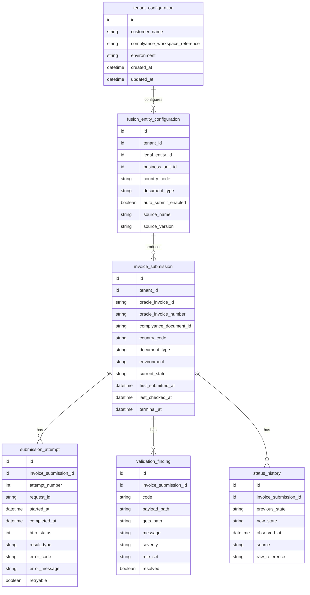

This schema is deliberately designed around the lifecycle shown in the Complyance documentation rather than around an assumed synchronous request/response model.

---

## 18. API Interaction Model

### Unify V2 submission

Conceptually:

```http
POST /api/v3/unify
Authorization: Bearer <API_KEY>
Content-Type: application/json
new-api: true
```

```json
{
  "country": "AE",
  "environment": "sandbox",
  "purpose": "invoicing",
  "source": "ORACLE_FUSION:1",
  "documentType": {
    "base": "tax_invoice",
    "modifiers": []
  },
  "payload": {
    "...": "Oracle Fusion source payload"
  }
}
```

The exact source name/version should be agreed with Complyance rather than assuming `ORACLE_FUSION:1` is already provisioned.

The current Unify V2 documentation requires `country`, `environment`, `purpose`, `source`, `documentType`, and `payload` for a single document, and says the source mapping must support the requested country and document type.

### Status retrieval

```http
GET /api/v3/documents/{documentId}/status
Authorization: Bearer <API_KEY>
```

The extension should poll according to a controlled backoff strategy and stop on terminal states.

---

## 19. Error Classification Matrix

| Complyance response | Extension behavior |
|---|---|
| `200` | Persist document ID and continue lifecycle tracking |
| `400` | Mark configuration/request error; do not blind retry |
| `401` | Authentication/configuration failure |
| `403` | Environment/workspace/permission issue |
| `404` | Mapping/source configuration problem |
| `409` | Workflow or resource conflict; inspect current state |
| `422` | Business/compliance validation; show actionable findings |
| `429` | Backoff; honor `Retry-After` |
| `500` | Controlled retry / support path depending on operation |

This matrix follows the current public Unify V2 error guidance.

---

## 20. Security Model

The security boundary should be:

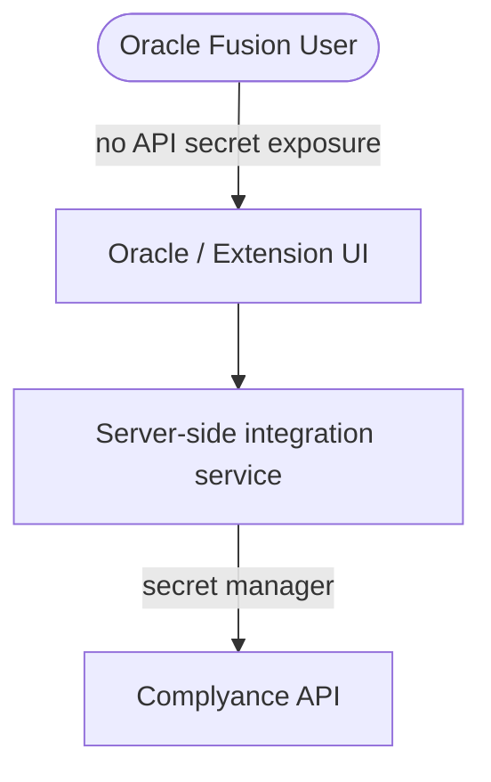

The public Complyance documentation explicitly says API keys should be kept server-side, not in browser/client applications, source control, or logs.

Therefore:

- Never store API keys in browser-visible JavaScript.
- Never place keys in Fusion page code.
- Use secret management.
- Separate sandbox and production credentials.
- Audit credential rotation.
- Log request identifiers, not secrets.
- Encrypt stored customer/invoice data where retained.

---

## 21. Why This Can Be Better Than a Generic Oracle Integration Project

A normal integration project sells engineering effort.

A Marketplace extension sells a **repeatable product**.

### Project model

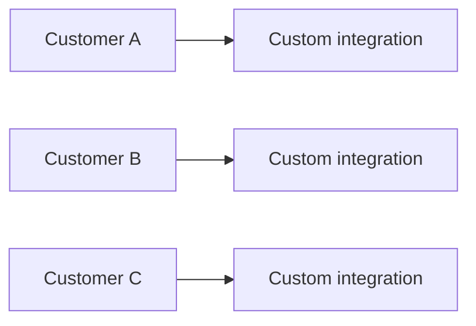

### Product model

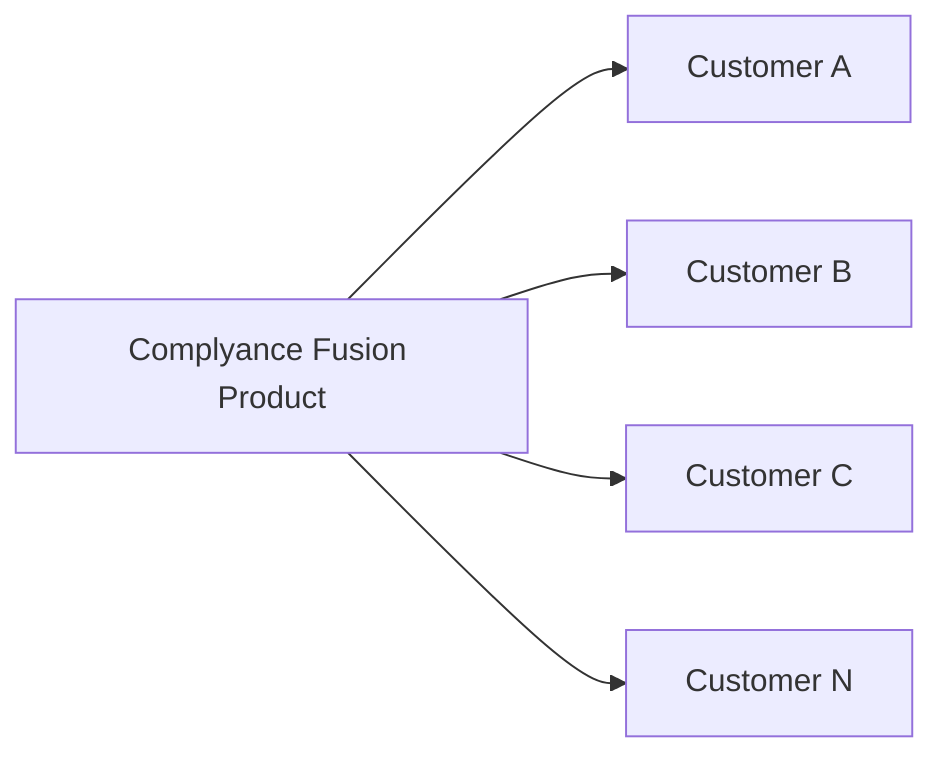

The second model creates reusable assets:

- one integration architecture,
- one source mapping strategy,
- one operational model,
- one support model,
- one UX pattern,
- reusable documentation,
- reusable test cases,
- reusable country expansion process.

That is the strategic reason I would build this as a Marketplace product rather than as a one-off connector.

---

## 22. Differentiation

The extension should not compete against Complyance's own API.

It should differentiate through:

### 1. Oracle-native workflow

Users remain in Oracle Fusion.

### 2. Implementation acceleration

The customer gets a prebuilt integration instead of starting from API documentation.

### 3. Compliance operations

Status, errors, retry, and audit are productized.

### 4. Multi-country readiness

The customer integrates once with the Oracle connector and relies on Complyance's existing global compliance infrastructure.

### 5. Marketplace distribution

The product becomes discoverable through Oracle's ecosystem instead of being introduced only as bespoke professional services.

---

## 23. What I Would Explicitly NOT Build in the First Version

To protect the scope and prevent duplication:

- A new tax rules engine.
- Country-specific XML generators.
- A competing GETS-like canonical model.
- A full replacement for Complyance's dashboard.
- Direct database access to Oracle Fusion.
- Dozens of custom country integrations before the first production pilot.
- Every Oracle Fusion invoice scenario on day one.

The first product should prove the **integration + workflow + operational UX**.

---

## 24. Key Technical Questions for Complyance Engineering

These questions are important enough to resolve before final architecture approval.

### API

1. Which API contract should the Marketplace product standardize on: Unify V2 only, or a combination of Unify V2 + Connect APIs?
2. What exact API version is considered production-stable for partners?
3. How should an Oracle Fusion source be provisioned and versioned?
4. Does Complyance want one source mapping for all countries or country-specific source mappings under one source?
5. What is the preferred production polling strategy for document status?
6. Are webhooks available or planned for final status updates?
7. What are production rate limits for invoice submission and status retrieval?
8. What request/response fields are guaranteed to remain stable?

### Tenant / onboarding

9. Should each Oracle customer map to a dedicated Complyance workspace/company, or should the Marketplace product operate as an ISV tenant model?
10. Can onboarding be automated through Connect APIs for the relevant countries?
11. What customer provisioning flow does Complyance want the extension to expose?

### Compliance

12. Which first country has the best commercial + technical fit?
13. Which invoice document types are required at launch?
14. How should credit/debit notes be handled?
15. How should country-specific mandatory fields be surfaced in Oracle?

### Product

16. What should be the customer-facing subscription model?
17. What should be included in Marketplace listing vs implementation services?
18. Who provides first-line support?
19. Who owns Oracle Marketplace publishing and product updates?

---

## 25. Risks I See

### Risk 1: Overbuilding

**Mitigation:** Keep Complyance as the compliance engine and make the extension an Oracle product layer.

### Risk 2: API/documentation drift

The current public API reference is still described as under construction.

**Mitigation:** Lock the partner integration contract with Complyance engineering and version the connector.

### Risk 3: Country-specific data gaps

Oracle may not contain all data required by a country-specific mapping.

**Mitigation:** Build pre-flight readiness checks and an explicit "missing compliance data" UX.

### Risk 4: False success

Submission accepted by the API is not necessarily final government acceptance.

**Mitigation:** Implement the documented asynchronous lifecycle and terminal-state handling.

### Risk 5: Duplicate invoices

Retries and network failures can create duplicate-submission risk.

**Mitigation:** Durable invoice/submission correlation and idempotent orchestration.

### Risk 6: Marketplace product becomes custom-services-heavy

If every customer requires extensive custom development, the Marketplace strategy loses its advantage.

**Mitigation:** Productize configuration, define strict extension boundaries, and standardize the supported Fusion workflow.

---

## 26. Recommended Product Roadmap

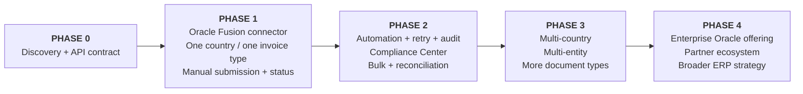

---

## 27. Success Metrics

The product should have measurable outcomes.

### Customer metrics

- Time from installation to first successful sandbox invoice.
- Time from installation to production go-live.
- Percentage of implementation completed using standard configuration.
- Percentage of invoices processed automatically.
- Mean time to resolve validation failures.

### Product metrics

- Submission success rate.
- Final acceptance rate.
- Percentage of records with complete audit trail.
- Retry success rate.
- Number of supported countries.
- Percentage of deployments requiring custom code.

### Business metrics

- Marketplace leads.
- Marketplace conversions.
- Average implementation revenue.
- Recurring revenue attributable to the Oracle product.
- Expansion from one country to additional countries.

The most important metric should be:

> **Customer time-to-go-live.**

That directly matches the problem the product is intended to solve.

---

## 28. My Recommendation

I recommend that Complyance pursue this as a **real product opportunity**, not merely as a technical connector.

The first version should be intentionally narrow:

> **Complyance for Oracle Fusion Cloud ERP: a Marketplace application that provides a prebuilt Oracle-to-Complyance e-invoicing workflow for one initial country and invoice type.**

The architecture should make Complyance's existing strengths do the heavy lifting:

- GETS handles canonical compliance normalization.
- Complyance mappings handle source-to-GETS transformation.
- Complyance validation handles country rules.
- Complyance produces/validates XML.
- Complyance performs the downstream compliance delivery.
- The Oracle product handles the customer experience around that engine.

This creates a clean division of responsibility and minimizes duplicated logic.

---

## 29. The Product I Would Build

At the simplest level:

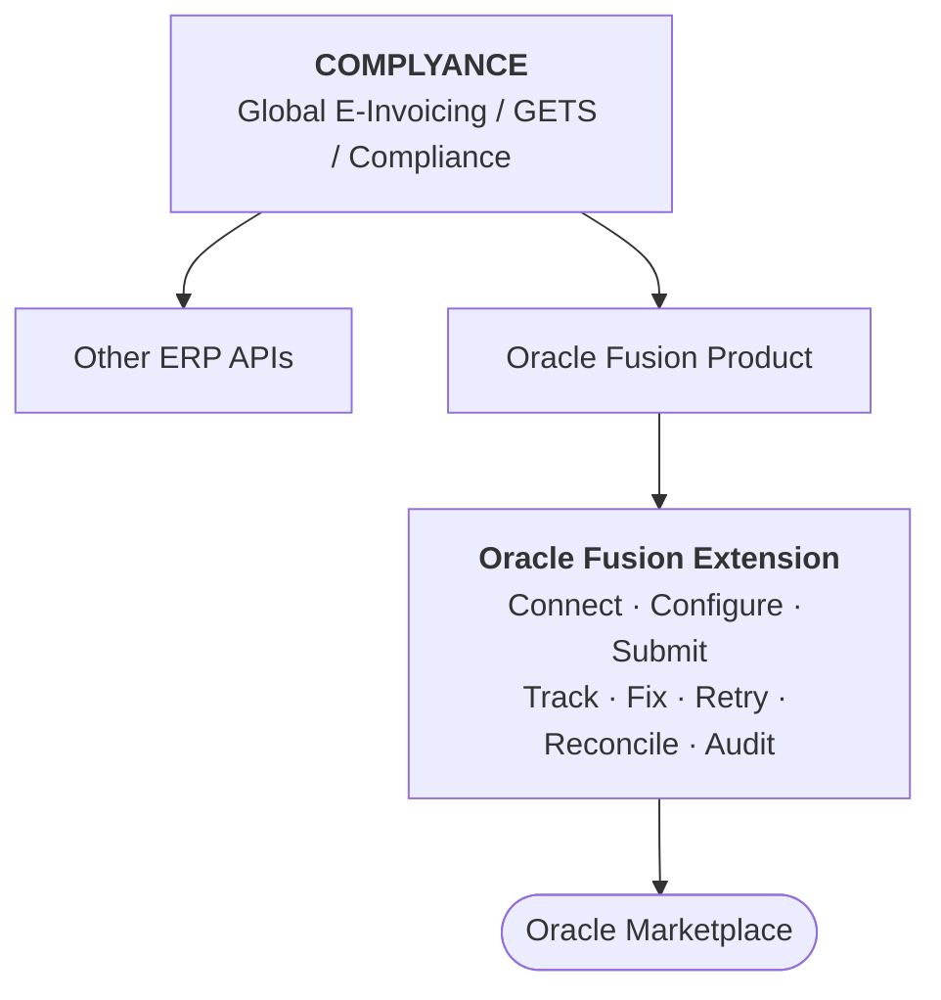

The extension becomes the **Oracle distribution and workflow layer for Complyance**.

---
