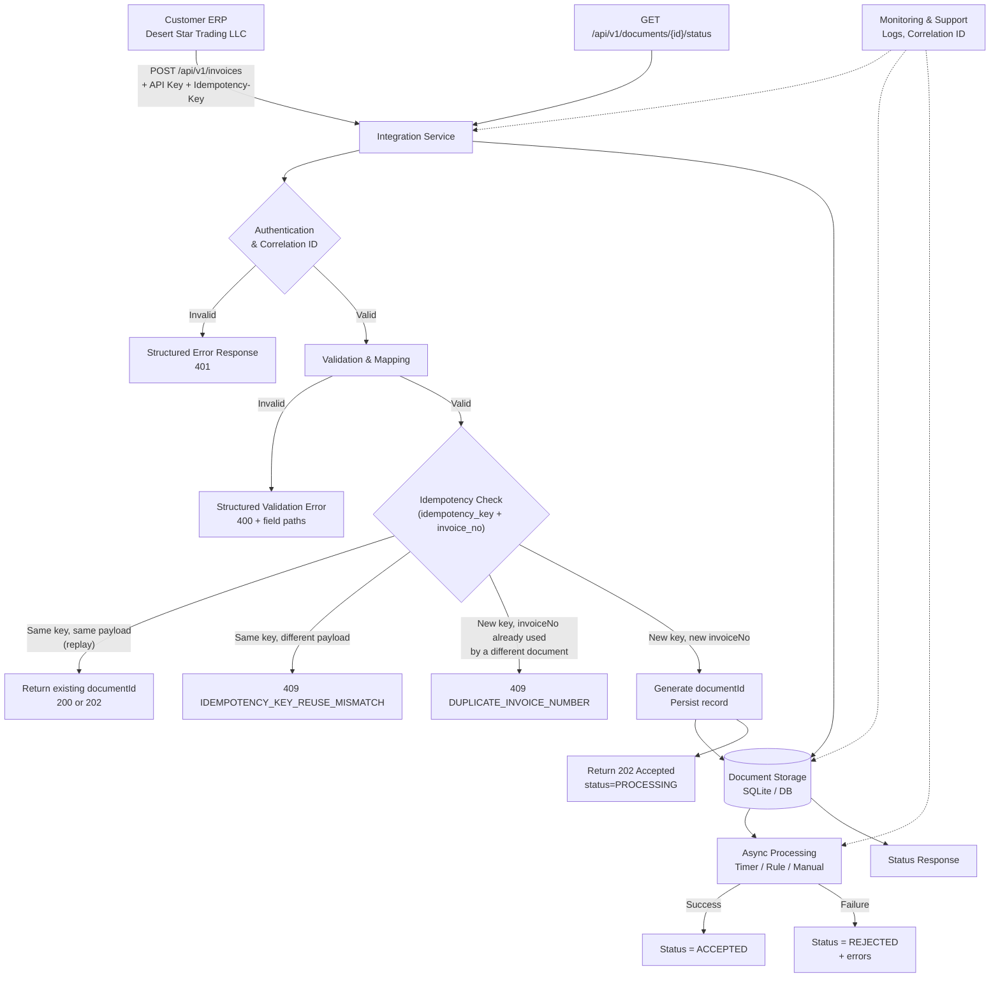

# System Flow

This reflects what `src/main.py` actually does, not an idealized future architecture.

```mermaid
flowchart TD
    A["Customer ERP<br/>Desert Star Trading LLC"] -->|"POST /api/v1/invoices<br/>+ API Key + Idempotency-Key"| B["Integration Service"]

    B --> C{"Authentication<br/>& Correlation ID"}
    C -->|Invalid| E["Structured Error Response<br/>401"]
    C -->|Valid| D["Validation & Mapping"]

    D -->|Invalid| F["Structured Validation Error<br/>400 + field paths"]
    D -->|Valid| G{"Idempotency Check<br/>(idempotency_key + invoice_no)"}

    G -->|"Same key, same payload<br/>(replay)"| H["Return existing documentId<br/>200 or 202"]
    G -->|"Same key, different payload"| H2["409 IDEMPOTENCY_KEY_REUSE_MISMATCH"]
    G -->|"New key, invoiceNo already used<br/>by a different document"| H3["409 DUPLICATE_INVOICE_NUMBER"]
    G -->|"New key, new invoiceNo"| I["Generate documentId<br/>Persist record"]

    I --> J[("Document Storage<br/>SQLite / DB")]
    I --> K["Return 202 Accepted<br/>status=PROCESSING"]

    J --> L["Async Processing<br/>Timer / Rule / Manual"]
    L -->|Success| M["Status = ACCEPTED"]
    L -->|Failure| N["Status = REJECTED<br/>+ errors"]

    O["GET /api/v1/documents/{id}/status"] --> B
    B --> J
    J --> P["Status Response"]

    Q["Monitoring & Support<br/>Logs, Correlation ID"] -.-> B
    Q -.-> J
    Q -.-> L
```
